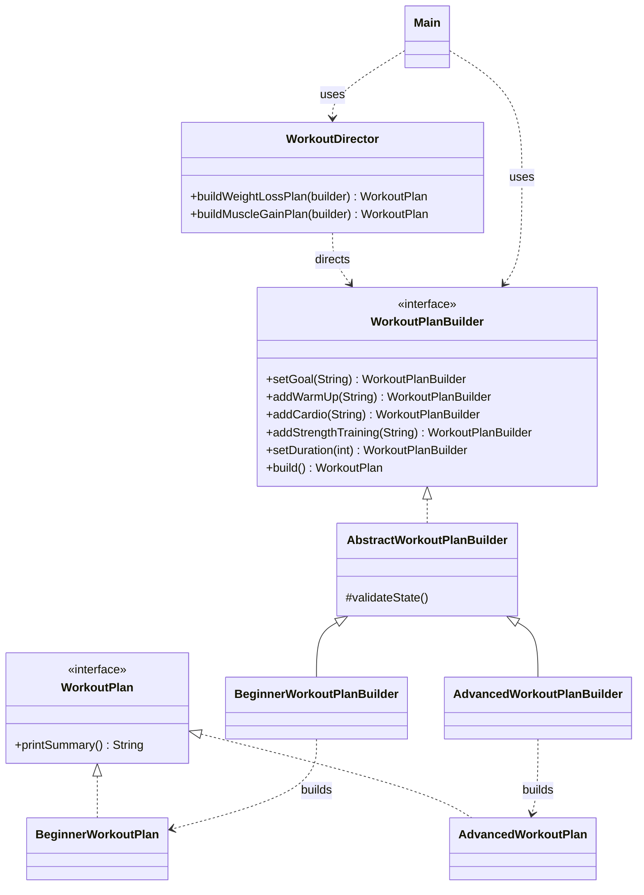

# Workout Plan Builder

Java implementation of the **Builder** creational design pattern.
Course: Software Design Patterns — Assignment #1 (Individual).

## 1. What this product is

The product being built is a **workout plan**: a goal, a warm-up, cardio,
optional strength training, and a total duration. Assembling a plan is
naturally incremental — you set the goal, then the warm-up, then cardio,
then optionally strength work — and the *same* sequence of steps can
produce genuinely different kinds of plans depending on fitness level.
That is exactly the situation the Builder pattern is designed for.

Two representations of a "finished plan" are supported from the exact
same construction steps:

- **BeginnerWorkoutPlan** — low intensity, adds a rest reminder.
- **AdvancedWorkoutPlan** — high intensity, adds an estimated calorie burn.

Swapping which concrete builder is handed to the Director (or used
directly) is the only thing that changes — no `if (beginner) {...} else
{...}` branching anywhere in client code.

## 2. How the requirements map to the code

| Requirement | Class(es) |
|---|---|
| Product | `WorkoutPlan` (interface), `BeginnerWorkoutPlan`, `AdvancedWorkoutPlan` |
| Builder | `WorkoutPlanBuilder` (interface), `AbstractWorkoutPlanBuilder`, `BeginnerWorkoutPlanBuilder`, `AdvancedWorkoutPlanBuilder` |
| Director | `WorkoutDirector` |
| Client | `Main` |



**Why a Director specifically?** `WorkoutDirector` hardcodes two plan
*shapes* ("weight loss" = running + 45 min, "muscle gain" = strength
training + 60 min) so calling code never has to remember the right
order/combination of builder calls. `Main` also shows the builder used
*without* a Director, for a fully custom one-off plan — both are valid
uses of the pattern, and the assignment brief asks for both.

## 3. Build & run

**IntelliJ IDEA:** open the project folder and run `Main`.

**Command line:**
```bash
javac -d out $(find src -name "*.java")
java -cp out univ_assignments.SDP_ASS_1.Main
```

### Actual program output
```
---- Director: reusable plan templates ----

=== Beginner (low intensity) ===
Goal: Weight Loss
Warm-up: Jumping jacks
Cardio: Running 30 mins
Duration: 45 minutes
Note: Rest 60-90 seconds between each exercise.

=== Advanced (high intensity) ===
Goal: Weight Loss
Warm-up: Jumping jacks
Cardio: Running 30 mins
Duration: 45 minutes
Estimated calories burned: 428 kcal

=== Advanced (high intensity) ===
Goal: Muscle Gain
Warm-up: Dynamic stretching
Cardio: Brisk walking 10 mins
Strength training: Squats, bench press, deadlifts (4x8)
Duration: 60 minutes
Estimated calories burned: 570 kcal

---- Client: fully custom plan (no Director) ----

=== Beginner (low intensity) ===
Goal: Flexibility
Warm-up: Light jogging 5 mins
Cardio: Jump rope 10 mins
Duration: 20 minutes
Note: Rest 60-90 seconds between each exercise.

---- Client: invalid build is rejected ----

Build correctly rejected: Cannot build workout plan: warm-up is required
```
Notice the same `buildWeightLossPlan()` call produces two different
printed representations (Beginner vs Advanced) — this is the "same
construction process, different representations" idea the Builder
pattern is named for.

## 4. Clean Code principles applied

### 4.1 Meaningful, intention-revealing names
No abbreviations, no `Manager`/`Data`/`Info` filler; a name alone tells
you what a method does.

**Without this principle:**
```java
public interface Bldr {
    Bldr s1(String x);
    Object bld();
}
```
**Applied here** (`WorkoutPlanBuilder.java`):
```java
public interface WorkoutPlanBuilder {
    WorkoutPlanBuilder setGoal(String goal);
    WorkoutPlan build();
}
```

### 4.2 Small methods that each do one thing
`build()` does not also validate — it delegates to `validateState()`.
`printSummary()` does not also compute calories — that is
`estimateCaloriesBurned()`'s job.

**Without this principle:**
```java
public WorkoutPlan build() {
    if (goal == null || warmUp == null || cardio == null
            || durationInMinutes < 15) {
        throw new IllegalStateException("invalid plan");
    }
    System.out.println("Built a plan for " + goal);
    return new BeginnerWorkoutPlan(goal, warmUp, cardio, strengthTraining, durationInMinutes);
}
```
**Applied here** (`BeginnerWorkoutPlanBuilder.java`):
```java
@Override
public WorkoutPlan build() {
    validateState();
    return new BeginnerWorkoutPlan(goal, warmUp, cardio, strengthTraining, durationInMinutes);
}
```

### 4.3 Small, focused classes
Each class has exactly one reason to change: `BeginnerWorkoutPlan` /
`AdvancedWorkoutPlan` only format and present a finished plan;
`AbstractWorkoutPlanBuilder` only accumulates state and validates it;
`WorkoutDirector` only knows two plan "shapes". Nothing is a single
giant class doing everything.

### 4.4 Validated construction — fail fast with a clear exception
`build()` never returns a half-built object. Every concrete builder
calls `validateState()` first, which throws `IllegalStateException`
with a message that says exactly what is missing.

**Without this principle:**
```java
public WorkoutPlan build() {
    return new BeginnerWorkoutPlan(goal, warmUp, cardio, strengthTraining, durationInMinutes);
    // goal == null here just silently produces a broken plan
}
```
**Applied here** (`AbstractWorkoutPlanBuilder.java`):
```java
protected void validateState() {
    if (goal == null || goal.isBlank()) {
        throw new IllegalStateException("Cannot build workout plan: goal is required");
    }
    if (durationInMinutes < MINIMUM_WORKOUT_DURATION_MINUTES) {
        throw new IllegalStateException(
                "Cannot build workout plan: duration must be at least "
                        + MINIMUM_WORKOUT_DURATION_MINUTES + " minutes");
    }
    // ...
}
```
`Main.demonstrateValidationFailure()` shows this being caught and
reported cleanly instead of crashing the program.

### 4.5 No magic numbers or strings
Every "unexplained" literal became a named constant with a comment
where the meaning isn't obvious.

**Without this principle:**
```java
if (durationInMinutes < 15) { ... }        // why 15?
double calories = minutes * 9.5;           // why 9.5?
```
**Applied here:**
```java
protected static final int MINIMUM_WORKOUT_DURATION_MINUTES = 15;
...
/** Rough estimate of calories burned per minute of a high-intensity session. */
private static final double CALORIES_PER_MINUTE_ESTIMATE = 9.5;
```

### 4.6 Encapsulation (bonus)
`WorkoutPlan` fields are `private final` and only ever set once, through
the constructor called from `build()` — nothing outside the product
class can mutate a plan after it is created.

## 5. Project structure
```
workout-builder/
├── README.md
└── src/main/java/univ_assignments/SDP_ASS_1/
    ├── Main.java
    ├── WorkoutPlan.java
    ├── BeginnerWorkoutPlan.java
    ├── AdvancedWorkoutPlan.java
    ├── WorkoutPlanBuilder.java
    ├── AbstractWorkoutPlanBuilder.java
    ├── BeginnerWorkoutPlanBuilder.java
    ├── AdvancedWorkoutPlanBuilder.java
    └── WorkoutDirector.java
```

## 6. Author
SE-2512 Urazbek Bek — individual assignment, Software Design Patterns.
